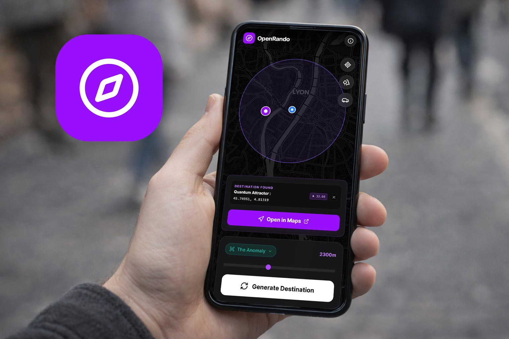

# OpenRando 

OpenRando is an open-source, web-based alternative to Randonautica that generates unique, random real-world coordinates for you to explore. 

By leveraging your device's native Cryptographically Secure Random Number Generator and applying Kernel Density Estimation (KDE), the application calculates concentrated areas of probability ("attractors") to break your daily routine and send you on an adventure. 

### 👉 [Launch the App](https://realjck.github.io/OpenRando/)

**Features:**
- Set your starting location via GPS or by clicking on the map.
- Choose a search radius between 500m and 5km.
- Select an Intention to tune the quantum generation strategy (9 modes available).
- Generate unpredictable true-random destination points.
- Toggle the display of parks, forests, and other public areas within your search radius.
- Automatically identify the 3 closest parking spots to your generated destination.
- Open the coordinates directly in Google Maps.

Built with React, Leaflet, and Tailwind CSS.

## About the Theory

OpenRando is inspired by the **Fatum Project**, a research initiative exploring "probability blind-spots" (places in the physical world that fall outside our daily deterministic routines). Read more about the theory [here](https://github.com/anonyhoney/fatum-en/blob/master/docs/fatum_theory.txt).

### Key Concepts
- **Attractors**: Areas where a high concentration of random points occurs. According to the theory, these clusters might represent anomalies influenced by human "Intent" (the Genesis Field).
- **Reality-Tunnels**: The mental and causal loops that limit our perspective and actions.
- **Blind-Spots**: Locations nearby that you would never visit because no logic or habit would ever lead you there.

### Hardware Entropy vs. QRNG

While the original Fatum project often relies on external Quantum Random Number Generator (QRNG) servers (like ANU), OpenRando is designed for privacy, speed, and independence.

Instead of polling remote APIs, this application utilizes your device's native Cryptographically Secure Pseudo-Random Number Generator (CSPRNG). This algorithm generates randomness by harvesting local entropy from the system's hardware noise and environmental events.

This ensures that your exploration remains entirely local and private, while still providing the level of unpredictability needed to "break" deterministic outcomes.

## 🤝 Contributing 
OpenRando is an open-source project and contributions are more than welcome! Whether you want to fix a bug or suggest a feature, feel free to open an Issue or submit a Pull Request.